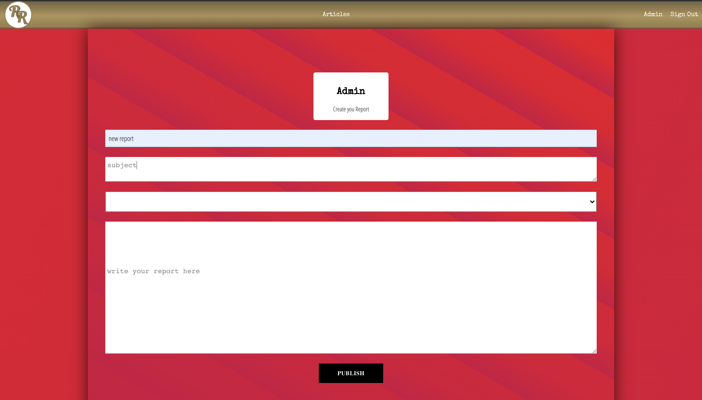

<!DOCTYPE html>
<html lang="en">
  <head>
    <meta charset="UTF-8" />
    <meta name="viewport" content="width=device-width, initial-scale=1.0" />
    <title>How Rabona Works</title>
    <link rel="stylesheet" href="./styles.css" />
  </head>
  <body>
    

      
<h1>Rabona Report</h1>

      
<h2>Public</h2>

      
<h3>Home page</h3>

      

        

          
        

        

          

            Public users are able to view the 5 lastest reports that are
            published on the home page the inital post is just a breif, which
            contains the author, when it was published, the title, and a subject
            outline.
          

        

      

      
<h5>Reports</h5>

      

        

          
        

        

          
to view the full report just click the post

        

      

      
<h3>Articles Page</h3>

      

        

          
        

        

          

            If a user can not find the article they are looking for on the
            homepage, then the articles page would be the answer. Housing a
            search bar allowing you to search through all articles in the
            database using the title name.
          

        

      

      <h2>Admins</h2>

      
<h3>Login page</h3>

      

        

          
        

        

          

            if you are an adminstator you are allowed acess to other secure
            pages, use the login page to sign in. Once you are signed on you
            will be automatically be directed back to teh homepage, but you will
            notice the navbar now has 'sign out' and "Admin"
          

        

      

      
<h3>Admin Page</h3>

      

        

          
        

        

          
on the admin page you have two options create or delete

        

      

      
<h5>Create Report Page</h5>

      

        

          
        

        

          

            adminstators are able to submit report by completing the form. it
            will not be published unless all feild are submited. once published
            the report is added to the home page in real time.
          

        

      

      
 <h5>Delete Report Page</h5>

      

        

          
          
        

        

          

            adminstators are able to delete reports with a click of a button, the
            page loads with a list of all reports create by that adminstator only.
            which means you can not delete another authors reports. once delete you
            are directed back to the homepage and your report is deleted from teh
            database you also have an option to view you report.
          

        

      

    

  </body>
</html>
